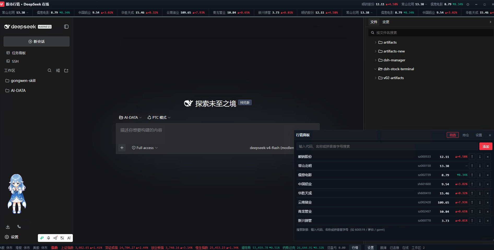

# 📈 dsh-stock-terminal · 股市行情皮肤 + 功能插件

> **DSH Web GUI（DeepSeek Harness）行情皮肤与功能插件**：全局交易终端视觉 + 实时行情面板。
> 自选跑马灯、首字母模糊搜索、持仓盈亏管理，A股 / 港股 / 美股 / 指数 / 加密 / 外汇一站式盯盘。

<p align="center">
  
</p>

[](LICENSE)
[](#安装)
[](./package.json)
[](https://github.com/dsh-market/dsh-market/pull/160)

---

## ✨ 功能亮点

| 能力 | 说明 |
| --- | --- |
| 🎨 **交易终端皮肤** | 顶栏 K 线品牌 + 持仓个股名称 + 涨跌幅 + 总盈亏芯片；红涨绿跌（亮/暗双主题）；仿终端窗口外框 |
| 📢 **实时行情跑马灯** | 自选列表无缝循环滚动，hover 暂停；**点击任一品种弹出个股 K 线图**（日K/周K/月K 可切换，蜡烛 + MA5/MA10 + 成交量幅图） |
| 📈 **个股 K 线弹窗** | 日K / 周K / 月K 一键切换；A股/港股/指数走腾讯前复权数据；美股腾讯数据不足时自动回退 Yahoo；加密货币走 Binance；服务端 60s 缓存 + 在途去重 |
| 🧭 **自选列表** | 增删 / ↑↓ 排序 / 移除；**拼音首字母 + 代码 + 名称模糊搜索联想**（如 `gzmt` → 贵州茅台、`600519`、`茅台`），在线 API 兜底 |
| 💼 **持仓管理** | 模糊搜索添加持仓（与自选同款联想体验）；代码 + 数量 + 成本价 → 现价 / 市值 / 浮动盈亏 / 盈亏率，底部汇总 |
| 🏷 **标题栏持仓摘要** | 持仓个股名称 + 涨跌幅按标题栏宽度自适应显示，超宽时自动收起为「等 N 只」+ 总盈亏；窗口 resize 重新适配 |
| 📏 **伸缩条** | 拖动面板顶部伸缩条调整高度（替代 CSS resize 右下角把手），高度持久化到 localStorage |
| ⏱ **交易时段** | 状态栏实时显示 A股 / 港股 / 美股 盘中·午休·盘前·休市 |
| 📊 **指数快照** | 上证 / 深成 / 创业板 / 恒指 / 道指 / 纳指实时快照 |
| ⚙ **双设置入口** | 状态栏「设置」按钮 + 标题栏齿轮 + 面板内「设置」页签；DSH 系统设置侧边栏出现独立「股市行情」分区（可直接管理刷新间隔 / 自选 / 持仓） |
| 🗃 **数据持久化** | 自选 / 持仓存浏览器 localStorage，重开不丢 |

---

## 📦 安装

本插件为 **DSH Web GUI 外部插件**，与 dsh-market 收录的 [dsh-stock-watch](https://github.com/Awu12277/dsh-stock-watch)、[dsh-shortcuts](https://github.com/Ricketts-Guo/dsh-shortcuts) 等插件采用相同的安装模式。

### 方式一：CLI 一键安装（推荐）

```sh
# 从 GitHub 安装（dsh 自动处理 pnpm 安装 + bundle 注册）
dsh plugin --profile web add github:linhut/dsh-stock-terminal

# 重启 dsh web 使插件生效（杀进程重新启动，或 terminal 中 Ctrl+C 后重跑）
# 找到原启动命令，重新执行即可（通常是下面这样）：
# node E:\npm-global\node_modules\@deepseek-ai\dsh\lib\bin.js web
```

> 若提示 `allowBuilds` 错误，将 `@linxin666/dsh-client-ui-skin-stock` 加入
> `~/.dsh/profiles/web/pnpm-workspace.yaml` 的 `allowBuilds` 列表后重试。
>
> 若 `dsh plugin` 命令不可用，请升级 DSH 至 `0.1.0-rc.6` 或更新版本。

### 方式二：手动安装

```yaml
# 1. 编辑 ~/.dsh/cordis.patch.yml（home 层，只写这一处，勿在多层重复）
- insert:
    - id: ui-skin-stock
      name: '@linxin666/dsh-client-ui-skin-stock'
```

```sh
# 2. 克隆或复制本仓库到 profile 的 node_modules
git clone https://github.com/linhut/dsh-stock-terminal.git \
  ~/.dsh/profiles/web/node_modules/@linxin666/dsh-client-ui-skin-stock

# 3. 重启 dsh web（杀进程重新启动，或 Ctrl+C 后重跑启动命令）
# 找到 dsh web 进程 (PID) 杀掉后重新启动，或 Ctrl+C 后重跑原启动命令
```

### 方式三：通过插件市场安装（待收录）

本插件已提交 [dsh-market PR #160](https://github.com/dsh-market/dsh-market/pull/160)，合并后即可在 **设置 → 插件市场** 中搜索 `dsh-stock-terminal` 一键安装。

### 安装后

1. 刷新浏览器（`Ctrl+F5` 硬刷新清除缓存）
2. 应看到股市主题的标题栏，底部状态栏出现「行情」按钮
3. 点击「行情」打开面板 → 添加自选股开始使用

> 卸载：`dsh plugin --profile web remove @linxin666/dsh-client-ui-skin-stock` + 重启；
> 或删除 `~/.dsh/cordis.patch.yml` 中对应行 + 重启，**不影响 DSH 本体运行**。

---

## 🎯 数据源与符号语法

| 语法 | 示例 | 含义 | 数据源 |
| --- | --- | --- | --- |
| `sh` + 6 位 | `sh600519` 贵州茅台 | 沪市 A 股 / 上证指数 | 腾讯行情 |
| `sz` + 6 位 | `sz000001` 平安银行 · `sz399001` 深证成指 | 深市 | 腾讯行情 |
| `hk` + 5 位 | `hk00700` 腾讯控股 · `hkHSI` 恒生指数 | 港股 / 恒指 | 腾讯行情 |
| `us` + 代码 | `usAAPL` 苹果 · `usDJI` 道指 · `usIXIC` 纳指 | 美股 / 美指 | 腾讯行情 |
| 大写组合 | `BTCUSDT` `ETHUSDT`… | 加密货币（24h） | Binance |
| `AAA/BBB` | `USD/CNY` | 外汇（美元等基准） | Frankfurter |

> 数据由**宿主端聚合代理**统一拉取（`/plugins/dsh-stock/api/quotes`，GBK 解码、超时降级），
> 浏览器零 CORS；代理不可用时自动降级为浏览器直连。

---

## 🔍 搜索联想

支持以下方式模糊匹配（取前 8 条）：

- **拼音首字母**：`gzmt` → 贵州茅台、`csbm` → 常山北明、`zsyh` → 招商银行
- **代码**：`600519`、`000158`、`AAPL`、`BTC`…
- **名称**：`茅台`、`苹果`、`比亚迪`…（中英文子串）

内置 130+ 常用品种词典秒出结果；**词典未收录的品种自动走在线兜底**——
宿主代理新浪股票建议 API（`/plugins/dsh-stock/api/suggest`，GBK 解码、300ms 防抖），
任意 A股 / 港股 / 美股 / 指数输入代码、简称或拼音首字母即可联想。

键盘 ↑↓ 选择、Enter 添加、Esc 关闭。

---

## 📁 项目结构

```
dsh-stock-terminal/
├── lib/
│   ├── index.js      # 宿主端：行情聚合代理 /plugins/dsh-stock/api/quotes + /suggest + /kline
│   └── client.js     # 浏览器端：皮肤 chrome + 行情面板（自选/持仓/设置）+ K 线弹窗 + 系统设置卡
├── skin.json         # 皮肤注册元数据（id: stock，wiring: ui-skin-stock）
├── package.json      # DSH 插件包清单（dsh.client / dsh.bundle 元数据）
├── cordis.patch.yml  # 插件接线
├── assets/
│   └── screenshot.png
└── README.md
```

---

## ⚙️ 集成方式

### 接线策略

- **CLI 安装**（方式一）：`dsh plugin` 自动管理 profile 层的 bundle 注册，无需手动编辑补丁文件
- **手动安装**（方式二）：home 层 `~/.dsh/cordis.patch.yml` 单行 insert

### ⚠️ 重要

- 切勿把同一 `insert` 同时写进 profile patch 与 home patch —— 两层叠加会产生重复 loader
  entry id，触发 DSH fail-loud 启动保护
- 皮肤中心（dsh-client-ui-skin-center）可识别本皮肤（`skin.json` 位于
  `node_modules/@linxin666/` 下）；切换皮肤时可能将本行视为 legacy 皮肤行移除，重加该行即可
- DSH 系统设置侧边栏出现独立「股市行情」分区 —— 可管理刷新间隔、自选列表、持仓信息，
  与面板内数据双向同步（同一份 localStorage 读写）

---

## 🛠 技术要点

- 红涨绿跌配色：up `#e02e3d` / dark `#f23645`，down `#089981`，平灰；深色主题整套 CSS 变量切换
- `Intl.DateTimeFormat` 按 Asia/Shanghai、Asia/Hong_Kong、America/New_York 实时判定交易时段
- 数据轮询 30s（可调 15/30/60s），`ctx.effect` 一次性收回所有 DOM / 定时器
- 客户端形态：`window.__ModuleLoader__.load({ id, factory })`，`exports.apply` + `exports.inject`
- Canvas 蜡烛图绘制：日K/周K/月K 自适应、MA5/MA10 均线、成交量幅图、网格+价格+日期轴

---

## 🛡 可靠性设计

- **宿主端短 TTL 缓存 + 在途请求去重**：quotes 5s / suggest 30s / kline 60s 缓存，并发同参数请求共享同一次上游拉取（上限 128 条防无界增长）
- **符号规范化**：`SH600519` 等大写市场前缀自动转小写（外汇对 `USD/CNY` 保持原样）
- **轮询调度**：setTimeout 链式调度（上一次完成再排下一次）+ 在途请求守卫；页面隐藏时暂停轮询，回到前台立即刷新
- **跑马灯不闪跳**：行情刷新只原地更新数字，不重建 DOM，动画位置不被重置
- **联想防竞态**：搜索建议加序号计数器，慢的旧请求不会覆盖新输入的结果
- **故障降级提示**：全部数据源失败时 toast 一次性提示并自动重试；代理失败自动降级浏览器直连
- **设置双向即时生效**：系统设置卡修改刷新间隔/跑马灯后，面板轮询与跑马灯立即重排（自定义事件同步）
- **K 线周期自适应**：服务端原生支持 day/week/month（腾讯 fqkline / Binance / Yahoo）；客户端聚合 fallback 确保不重启也能用

---

## 🧩 标签 / Topics

`dsh-plugin` · `deepseek-harness` · `web-ui` · `skin` · `stock` · `行情` · `跑马灯` ·
`自选股` · `持仓` · `K线` · `trading-terminal` · `ticker` · `longbridge-alternative`

---

## 📄 License

[Apache-2.0](LICENSE)

---

*由 [linhut](https://github.com/linhut) 维护，已提交 [dsh-market](https://github.com/dsh-market/dsh-market) 收录。*
*DSH 插件安装参考了 [dsh-market](https://github.com/dsh-market/dsh-market) 的 `dsh plugin` 命令模式。*